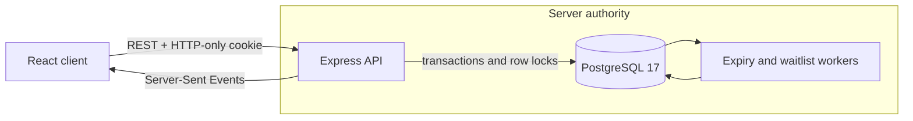
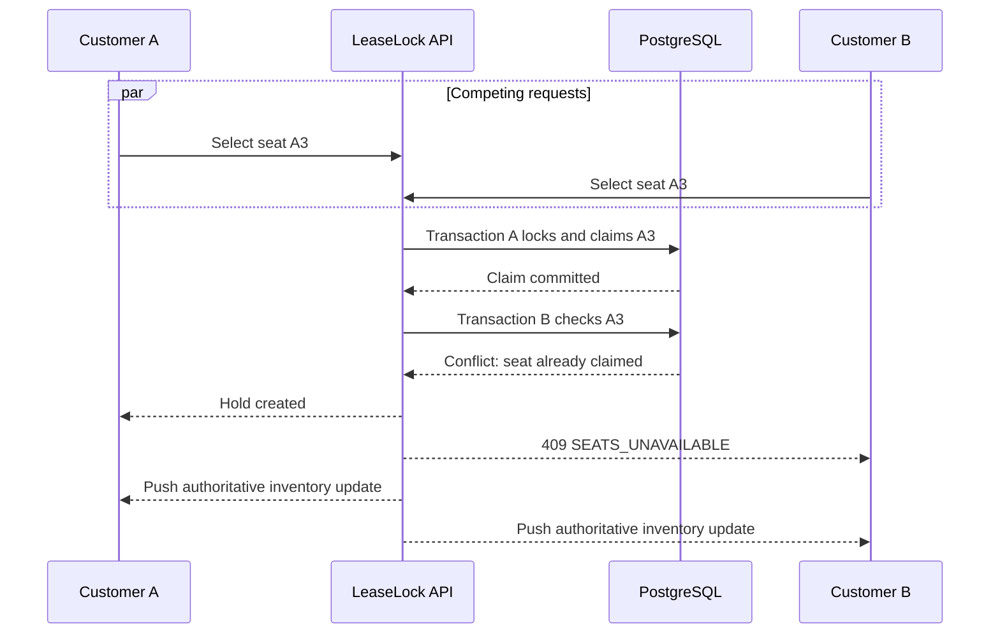

<div align="center">

# LeaseLock

### Concurrency-safe ticket booking, built around one non-negotiable rule:
### one seat, one winner.

[](https://react.dev/)
[](https://expressjs.com/)
[](https://www.postgresql.org/)
[](https://www.docker.com/)
[](#verification)

**A production-style event reservation platform that resolves simultaneous seat requests atomically, synchronizes availability in real time, and keeps every critical booking decision on the server.**

[Explore the architecture](#architecture) · [Run locally](#run-locally) · [Understand seat contention](#how-seat-contention-is-resolved) · [Review the API](#api-surface)

</div>

---

## Why LeaseLock exists

Most ticket-booking demos stop at a seat grid and a checkout form. LeaseLock focuses on the difficult part: **what happens when many customers want the same seat at the same moment?**

The interface never declares a seat won. It submits an intent; PostgreSQL decides the winner inside a transaction. Once committed, the API pushes the authoritative inventory change to every connected seat map using Server-Sent Events.

The result is a complete portfolio system covering authentication, inventory, temporary holds, mock checkout, cancellations, refunds, waitlists, administration, observability, testing, and containerized delivery.

## Built in 11 focused days

LeaseLock was designed and implemented locally over eleven focused development days, then prepared for publication as a complete repository. The GitHub publication date therefore represents when the project was shared—not the entire development period.

| Day | Focus | What was created | Engineering outcome |
|---:|---|---|---|
| **01** | Product definition | Roles, booking journey, cancellation policy, hold duration, scope, and acceptance criteria | Established precise rules before implementation |
| **02** | Backend foundation | Express API, middleware, versioned routes, health checks, configuration, and error responses | Created a stable server foundation |
| **03** | Database and Docker | PostgreSQL 17, Docker Compose, persistent storage, migrations, seed data, and readiness checks | Replaced temporary state with durable infrastructure |
| **04** | Authentication | Registration, login, logout, bcrypt password hashing, HTTP-only cookies, sessions, and role authorization | Secured customer and administrator access |
| **05** | Event inventory | Event discovery, event details, assigned seats, sections, prices, and administrator inventory management | Connected the booking interface to live PostgreSQL data |
| **06** | Reservation engine | Transactional seat claims, five-minute backend holds, idempotency, deterministic row locking, and expiry processing | Guaranteed exactly one winner for simultaneous requests |
| **07** | Multi-seat experience | Replaced the original one-seat restriction with one grouped hold containing up to six seats | Made the booking flow practical for families and groups |
| **08** | Immediate live selection | Made every seat click create or update the backend hold and introduced Server-Sent Events | Other customers see held seats without manual refresh |
| **09** | Recovery and checkout | Added active-hold recovery, backend-only expiration, mock payments, retries, confirmation, cancellation, and refunds | Made refreshes, network uncertainty, and payment outcomes recoverable |
| **10** | Platform capabilities | Added waitlist promotion, administrator metrics, audit records, structured logging, security controls, and concurrency demonstration | Completed the customer and operational workflows |
| **11** | Verification and delivery | Added backend, frontend, integration and load tests, production build, Docker image, CI, operations guide, and placement-focused documentation | Produced a reproducible and demonstrable portfolio release |

### Development progression

```mermaid
flowchart LR
    D1[Day 1<br/>Requirements] --> D2[Day 2<br/>API foundation]
    D2 --> D3[Day 3<br/>PostgreSQL + Docker]
    D3 --> D4[Day 4<br/>Authentication]
    D4 --> D5[Day 5<br/>Event inventory]
    D5 --> D6[Day 6<br/>Safe seat claims]
    D6 --> D7[Day 7<br/>Grouped holds]
    D7 --> D8[Day 8<br/>Real-time seats]
    D8 --> D9[Day 9<br/>Recovery + checkout]
    D9 --> D10[Day 10<br/>Admin + operations]
    D10 --> D11[Day 11<br/>Tests + delivery]
```



The implementation was iterative. Important improvements—multi-seat grouping, immediate server-side selection, live inventory synchronization, active-hold recovery, and backend-only expiration—were introduced after testing earlier versions and identifying where customers could experience conflicts or become stuck.

## Product experience

| Customer journey | Administrative control |
|---|---|
| Browse published events and live availability | Create and update events |
| Select up to six seats in one grouped hold | Configure and inspect seat inventory |
| See contested seats change in real time | Monitor active holds and confirmed bookings |
| Recover an active hold after refresh or reconnect | Review operational metrics and audit activity |
| Simulate payment success, failure, cancellation, or delay | Run a protected concurrency demonstration |
| Cancel eligible seats and receive simulated refunds | Verify the single-winner invariant against PostgreSQL |
| Join an ordered waitlist and receive hold offers | Manage the platform through role-protected routes |

## What makes it technically interesting

- **Immediate server-side claims.** Selecting a seat creates or updates a real grouped hold before payment begins.
- **Exactly one winner.** Row locks, transactions, and a unique seat-claim invariant prevent double allocation.
- **Real-time inventory.** Server-Sent Events notify every open seat map immediately after an authoritative change.
- **Backend-owned expiration.** PostgreSQL timestamps and a background worker control hold expiry; the browser never decides validity.
- **Hold recovery.** Refreshing, reopening, or reconnecting restores the customer's current active hold.
- **Atomic multi-seat booking.** Up to six seats share one hold, one expiry, and one booking lifecycle.
- **Idempotent critical writes.** Retried hold and confirmation requests cannot create duplicate effects.
- **Secure sessions.** Opaque, database-backed session tokens are delivered through HTTP-only cookies.
- **Operational depth.** Health probes, structured logs, request IDs, audit records, rate limiting, CI, Docker, and load testing are included.

## Architecture



The React application owns presentation and transient interaction state. Express owns authentication, authorization, validation, and workflow orchestration. PostgreSQL owns allocation correctness and durable state.

### Core data lifecycle

```text
AVAILABLE → ACTIVE HOLD → PENDING PAYMENT → CONFIRMED BOOKING
     ↑            │               │                  │
     └────────────┴── expiry ─────┴── failure ───────┴── cancellation
```

## How seat contention is resolved

When two customers click the same seat, visual arrival time is irrelevant. The first request that successfully commits the database claim wins.



This behavior is protected at multiple layers:

1. Event-seat rows are locked in deterministic order.
2. Active claims are checked inside the same transaction.
3. `seat_claims.event_seat_id` is unique.
4. The losing request receives a stable conflict response.
5. Automated contention tests verify that exactly one claim survives.

## Technology

| Layer | Technology | Responsibility |
|---|---|---|
| Interface | React 19, React Router, Vite | Customer and administrator experiences |
| API | Node.js, Express 5 | Workflows, validation, authorization, live events |
| Database | PostgreSQL 17, raw SQL migrations | Transactions, constraints, durable state |
| Authentication | bcryptjs, opaque sessions, HTTP-only cookies | Password security and session revocation |
| Delivery | Docker, Docker Compose, GitHub Actions | Reproducible builds and automated verification |
| Testing | Node test runner, Vitest, Testing Library | Unit, integration, concurrency, UI, and load checks |

## Run locally

### Requirements

- Node.js 20 or newer
- Docker Desktop with the Docker engine running
- PowerShell, Command Prompt, or a POSIX-compatible shell

### 1. Start PostgreSQL

```powershell
docker compose up -d postgres
```

### 2. Install and prepare the application

```powershell
npm.cmd install
npm.cmd run db:migrate
npm.cmd run db:seed
```

### 3. Start the API

```powershell
npm.cmd run dev:server
```

### 4. Start the React application

In a second terminal:

```powershell
npm.cmd run dev
```

Open **http://localhost:3000**. The API runs at **http://localhost:8080**, and Vite proxies `/v1` requests during development.

### Demo accounts

| Role | Email | Password |
|---|---|---|
| Administrator | `admin@leaselock.local` | `Admin123!` |
| Customer | `customer@leaselock.local` | `Customer123!` |

These credentials are for local demonstrations only. Override them through environment variables and never use them in a public deployment.

## Run the complete production-style stack

```powershell
docker compose build api
docker compose run --rm api node server/db/migrate.js
docker compose run --rm api node server/db/seed.js
docker compose up -d
```

The compiled React application and API are then available together at **http://localhost:8080**.

Health endpoints:

- `GET /v1/health` — process liveness
- `GET /v1/health/ready` — API and PostgreSQL readiness

## API surface

| Area | Representative endpoints |
|---|---|
| Authentication | `POST /v1/auth/register`, `POST /v1/auth/login`, `POST /v1/auth/logout`, `GET /v1/auth/me` |
| Events | `GET /v1/events`, `GET /v1/events/:id`, `GET /v1/events/:id/seats` |
| Live inventory | `GET /v1/events/:id/seat-events` |
| Holds | `POST /v1/holds`, `PUT /v1/holds/:id/seats`, `GET /v1/holds/active/current`, `DELETE /v1/holds/:id` |
| Checkout | `POST /v1/holds/:id/checkout`, `POST /v1/holds/:id/confirm` |
| Payments | `POST /v1/payments`, `POST /v1/payments/:id/simulate`, `GET /v1/payments/:id` |
| Bookings | `GET /v1/bookings`, `GET /v1/bookings/:id`, `POST /v1/bookings/:id/cancel` |
| Waitlist | `POST /v1/waitlist`, `GET /v1/waitlist`, `DELETE /v1/waitlist/:id` |
| Administration | `/v1/admin/events`, `/v1/admin/seats`, `/v1/admin/dashboard`, `/v1/admin/concurrency-demo` |

Every protected operation verifies session identity, ownership, or role on the server. Error responses include a stable machine-readable `code` and a safe human-readable `message`.

## Reservation rules

- A customer may hold **one group of one to six seats** at a time.
- Every seat in a group belongs to the same event and expires together.
- A hold lasts **five minutes**, measured and enforced by the backend.
- Selecting additional seats does not reset the expiry.
- The seat map recovers an existing active hold after refresh or reconnect.
- Confirmation requires a successful mock payment.
- Cancellation is allowed until **two hours before the event**.
- Partial cancellation records a proportional simulated refund.
- Expired holds and unsuccessful payments never create confirmed inventory.

## Verification

Run the complete automated suite:

```powershell
npm.cmd run test:all
```

Or run each layer independently:

```powershell
npm.cmd run test:server
npm.cmd run test:frontend
npm.cmd run test:integration
npm.cmd run test:load
npm.cmd run build
```

Current verified baseline:

| Check | Result |
|---|---:|
| Backend API tests | 2 passing |
| Frontend component tests | 2 passing |
| PostgreSQL integration tests | 16 passing |
| Production frontend build | Passing |
| Load run | 500 requests, 25 concurrent, 0 failures |
| Observed load-test latency | p50 60.92 ms, p95 131.91 ms, p99 292.75 ms |

Load figures describe one local run and are not presented as a universal benchmark.

## Project structure

```text
LeaseLock/
├── src/                     React application and interface state
├── server/
│   ├── routes/              Versioned REST endpoints
│   ├── holds/               Transactional allocation engine
│   ├── bookings/            Booking queries and lifecycle
│   ├── realtime/            Server-Sent Events broadcaster
│   ├── jobs/                Expiry, cleanup, and waitlist workers
│   ├── middleware/          Auth, security, audit, and request context
│   └── db/                  Pool, migrations, and deterministic seed
├── scripts/                 Load-test utilities
├── docs/                    Requirements and operations guidance
├── .github/workflows/       Continuous integration
├── Dockerfile               Production image
└── compose.yaml             API and PostgreSQL stack
```

## Security and reliability choices

- Passwords are salted and hashed; plaintext credentials are never stored.
- Session tokens are opaque, hashed in PostgreSQL, revocable, and transported in HTTP-only cookies.
- Same-site cookie behavior and origin checks protect authenticated mutations.
- Rate limiting reduces authentication and reservation abuse.
- Request bodies are size-limited and validated at API boundaries.
- Resource ownership and administrator roles are checked server-side.
- Idempotency records protect retry-sensitive operations.
- Structured JSON logs include an `X-Request-Id` correlation value.
- Database constraints remain the final defense against duplicate allocation.

## Deliberate simulation boundaries

LeaseLock is a **production-style portfolio project**, not a commercial ticketing service. Payments are deterministic simulations; no banking credentials or real money are processed.

A real deployment would additionally require:

- A payment provider with signed webhooks and reconciliation
- Redis Pub/Sub or a durable event bus for live updates across multiple API instances
- Managed secrets, TLS, database backups, and disaster-recovery drills
- External monitoring, alerting, tracing, and capacity planning
- Email or SMS delivery, QR admission, fraud controls, and compliance review

These boundaries are documented intentionally so the demonstrated guarantees remain precise and credible.

## Documentation

- [Product requirements](docs/requirements.md)
- [Operations guide](docs/operations.md)

## Interview discussion points

LeaseLock is designed to support conversations about:

- Why database invariants are stronger than frontend locking
- How deterministic row locking and unique claims prevent double booking
- Where idempotency belongs in a payment-adjacent workflow
- Why live notifications do not replace authoritative reads
- How hold recovery handles refreshes and uncertain network outcomes
- How the architecture would evolve from one API instance to a distributed deployment

---

<div align="center">

**LeaseLock treats correctness as a product feature.**

Built to demonstrate full-stack engineering beyond the happy path.

© 2026 Timeregularity. Built as a full-stack systems engineering portfolio project.

</div>
