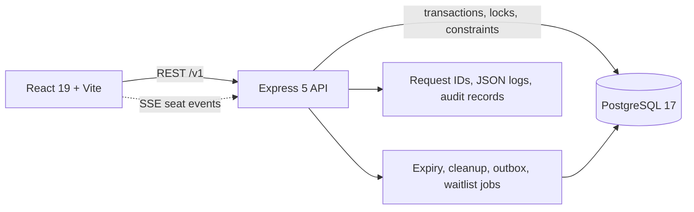
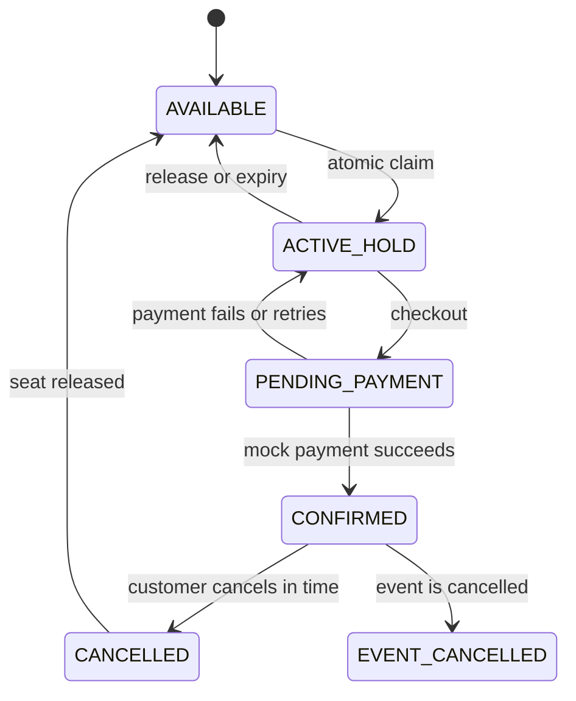
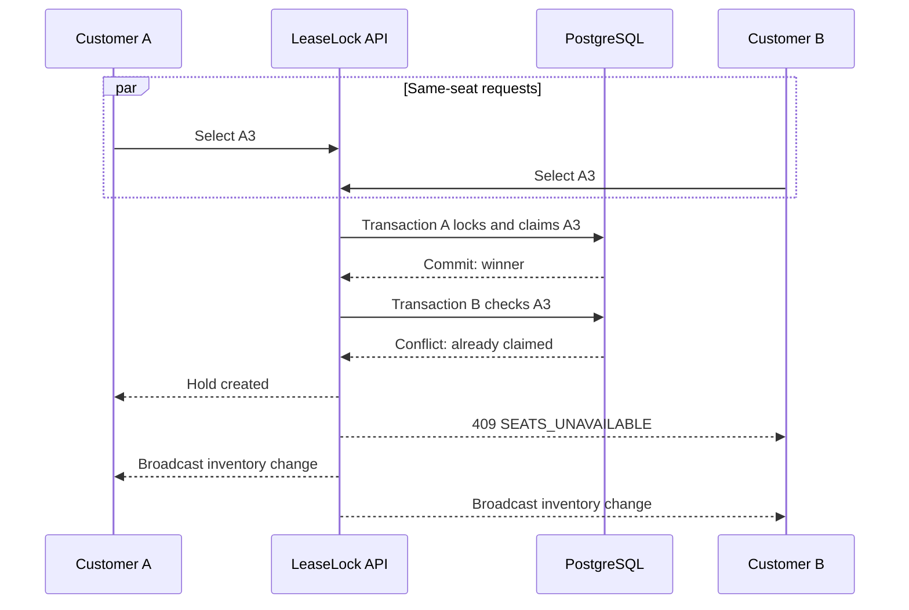

<div align="center">

# LEASELOCK

### The seat is not yours until the database says it is.

<p>Concurrency-safe event reservations for the moment when one seat has more than one future.</p>

[](https://react.dev/)
[](https://expressjs.com/)
[](https://www.postgresql.org/)
[](https://www.docker.com/)

**A production-style ticket reservation platform built around one invariant: one event seat, one winner.**

[Run it](#run-locally) · [See the architecture](#architecture) · [Test contention](#verification) · [Read the operations guide](docs/operations.md)

</div>

<br>

> [!IMPORTANT]
> LeaseLock is a portfolio-grade reservation system. Checkout and refunds are deterministic simulations; no real money or banking credentials are processed.

## The premise

Most booking demos are polished until two customers click the same seat. LeaseLock starts there.

The React client submits intent. The Express API validates it. PostgreSQL locks the relevant rows and commits the winner inside a transaction. Only after the database has decided does the server broadcast the new inventory state to connected clients.

That narrow order of authority is the whole point:

```text
Browser intent  ->  API validation  ->  PostgreSQL transaction  ->  committed inventory  ->  live update
```

The result is a complete reservation journey with authentication, temporary holds, grouped multi-seat booking, simulated checkout, cancellations, refunds, waitlists, administration, observability, and repeatable verification.

## Product at a glance

| For customers                               | For operators                      | Under the surface                       |
| ------------------------------------------- | ---------------------------------- | --------------------------------------- |
| Browse published events and availability    | Create and edit events             | PostgreSQL transactions and constraints |
| Hold 1-6 seats together for five minutes    | Inspect inventory and live holds   | Server-Sent Events for seat updates     |
| Recover an active hold after refresh        | Review metrics, audits, and health | Idempotent critical writes              |
| Checkout, cancel, and see simulated refunds | Run a protected race demonstration | Background expiry and waitlist jobs     |
| Join an ordered waitlist                    | Work through role-protected routes | HTTP-only sessions and rate limits      |

## Why it is interesting

- **The frontend never owns availability.** A countdown can inform the user, but only the backend can accept or reject a hold.
- **A group is atomic.** A customer can hold up to six seats from one event, and the request succeeds only when every seat is available.
- **Races have a deterministic outcome.** Conflicting requests are serialized by row locks and protected by unique database constraints.
- **Live updates are authoritative signals, not authority.** SSE keeps other seat maps fresh while PostgreSQL remains the source of truth.
- **Retries are expected.** Idempotency keys prevent uncertain network retries from duplicating holds, payments, confirmations, or cancellations.
- **Recovery is part of the journey.** Reloading or reconnecting restores the customer's active hold instead of leaving a reservation in limbo.

## Architecture



The frontend owns presentation and transient interaction state. Express owns authentication, authorization, validation, orchestration, and real-time delivery. PostgreSQL owns durable state and allocation correctness.

### The reservation lifecycle



### What happens in a race?



The guarantee is layered:

1. Requested seats are locked in deterministic order.
2. Active claims are checked inside the same transaction.
3. `seat_claims.event_seat_id` is unique.
4. The losing request receives a stable conflict response.
5. Automated contention tests verify that exactly one claim survives.

## Customer journeys

1. A guest discovers a published event and inspects public seat availability.
2. The customer registers or signs in through an opaque, HTTP-only session.
3. The seat map creates or updates one grouped hold of up to six seats.
4. The customer checks out through the deterministic payment simulation.
5. A successful confirmation creates one reservation and stores a seat/event snapshot.
6. The customer can view history, recover an active hold, cancel within the two-hour cutoff, or join a waitlist.

Administrators get event and seat management, dashboard statistics, audit visibility, and a protected concurrency demo. Admin access never bypasses the reservation invariant.

## Technology

| Layer     | Stack                                            | Role                                      |
| --------- | ------------------------------------------------ | ----------------------------------------- |
| Interface | React 19, React Router 7, Vite 7                 | Customer and admin experiences            |
| API       | Node.js, Express 5                               | Workflows, validation, authorization, SSE |
| Data      | PostgreSQL 17, raw SQL migrations                | Durable state, locking, constraints       |
| Security  | bcryptjs, HTTP-only cookies, Helmet, rate limits | Passwords, sessions, abuse controls       |
| Delivery  | Docker, Docker Compose, Render, Vercel           | Local and free-tier deployment paths      |
| Testing   | Node test runner, Vitest, Testing Library, k6    | API, UI, integration, load, contention    |

## Run locally

### Prerequisites

- Node.js 20 or newer
- Docker Desktop with the engine running
- PowerShell, Command Prompt, or a POSIX-compatible shell

### Development mode

```powershell
docker compose up -d postgres
npm.cmd install
npm.cmd run db:migrate
npm.cmd run db:seed
```

Start the API in one terminal:

```powershell
npm.cmd run dev:server
```

Start Vite in a second terminal:

```powershell
npm.cmd run dev
```

Open [http://localhost:3000](http://localhost:3000). Vite proxies `/v1` to the API at `http://localhost:8080`.

### Local demo accounts

| Role          | Email                      | Password       |
| ------------- | -------------------------- | -------------- |
| Administrator | `admin@leaselock.local`    | `Admin123!`    |
| Customer      | `customer@leaselock.local` | `Customer123!` |

These credentials are for local demonstrations only. Never enable them in a public deployment.

### Production-style Docker stack

```powershell
docker compose build api
docker compose run --rm api node server/db/migrate.js
docker compose run --rm api node server/db/seed.js
docker compose up -d
```

The API and compiled React application are then served together at [http://localhost:8080](http://localhost:8080).

Health probes:

- `GET /v1/health` checks process liveness.
- `GET /v1/health/ready` checks API and PostgreSQL readiness.

## API map

The API is versioned under `/v1`, uses JSON, and returns stable machine-readable error codes alongside safe messages.

| Area           | Representative routes                                                                   |
| -------------- | --------------------------------------------------------------------------------------- |
| Auth           | `POST /auth/register`, `POST /auth/login`, `POST /auth/logout`, `GET /auth/me`          |
| Events         | `GET /events`, `GET /events/:id`, `GET /events/:id/seats`                               |
| Live inventory | `GET /events/:id/seat-events`                                                           |
| Holds          | `POST /holds`, `PUT /holds/:id/seats`, `GET /holds/active/current`, `DELETE /holds/:id` |
| Checkout       | `POST /holds/:id/checkout`, `POST /holds/:id/confirm`                                   |
| Payments       | `POST /payments`, `POST /payments/:id/simulate`, `GET /payments/:id`                    |
| Bookings       | `GET /bookings`, `GET /bookings/:id`, `POST /bookings/:id/cancel`                       |
| Waitlist       | `POST /waitlist`, `GET /waitlist`, `DELETE /waitlist/:id`                               |
| Admin          | `/admin/events`, `/admin/seats`, `/admin/dashboard`, `/admin/concurrency-demo`          |

## Reservation rules

- One customer may have one active grouped hold at a time.
- A group contains 1-6 seats from the same event.
- Holds last five minutes from the server-recorded creation time.
- Adding seats does not reset the expiry.
- Expiry is enforced by backend jobs, never by browser clocks.
- Confirmation requires a successful mock payment.
- Cancellation is allowed until two hours before the event.
- Partial cancellation produces a proportional simulated refund.
- Expired holds and failed payments never create confirmed inventory.

## Verification

Run the complete suite:

```powershell
npm.cmd run test:all
```

Run individual layers:

```powershell
npm.cmd run test:server
npm.cmd run test:frontend
npm.cmd run test:integration
npm.cmd run test:load
npm.cmd run check:invariants
npm.cmd run build
```

For larger races, install [Grafana k6](https://grafana.com/docs/k6/latest/) and run the API against PostgreSQL:

```powershell
$env:BASE_URL = 'http://localhost:8080'
npm.cmd run test:k6:read

$env:ADMIN_EMAIL = 'admin@leaselock.local'
$env:ADMIN_PASSWORD = 'Admin123!'
$env:CONTENDERS = '50'
$env:SEAT_ID = 'A1'
npm.cmd run test:k6:contention
```

The contention script verifies the single-winner invariant. The load script supports `LOAD_TEST_URL`, `LOAD_TEST_REQUESTS`, and `LOAD_TEST_CONCURRENCY` overrides. Do not aim load tests at infrastructure without permission.

## Security and operations

- Passwords are salted and hashed; plaintext credentials are not stored.
- Session tokens are opaque, hashed in PostgreSQL, revocable, and sent in HTTP-only cookies.
- Same-site cookie behavior, origin checks, Helmet, body limits, and rate limits protect mutations.
- Ownership and administrator authorization are checked on the server.
- Idempotency records protect retry-sensitive workflows.
- JSON logs carry `X-Request-Id` correlation without logging credentials or unnecessary personal data.
- Audit records preserve critical administrative and reservation actions.
- Database constraints remain the final defense against duplicate allocation.

Production operations, backups, monitoring objectives, incident basics, and deployment configuration live in [docs/operations.md](docs/operations.md). Product scope and acceptance criteria live in [docs/requirements.md](docs/requirements.md).

## Deployment

The repository includes `Dockerfile`, `compose.yaml`, `render.yaml`, and `vercel.json` for a practical split deployment:

- Deploy the API to Render with PostgreSQL provided by Neon or another managed PostgreSQL service.
- Deploy the Vite frontend to Vercel with `VITE_API_ORIGIN` pointing to the API.
- Configure `DATABASE_URL` and the exact HTTPS `CLIENT_ORIGIN` on the API.
- Keep secrets in the platform secret manager and set `NODE_ENV=production`.

Render free services may sleep while idle, so the first request after inactivity can be slower.

## Project map

```text
LeaseLock/
├── src/                    React application, routes, pages, and styles
├── server/
│   ├── routes/             Versioned REST endpoints
│   ├── holds/              Transactional allocation engine
│   ├── bookings/           Booking queries and lifecycle
│   ├── realtime/           Server-Sent Events broadcaster
│   ├── jobs/               Expiry, cleanup, outbox, and waitlist workers
│   ├── middleware/         Auth, security, audit, and request context
│   └── db/                 Pool, migrations, and deterministic seed
├── scripts/                Load tests and invariant checks
├── docs/                   Requirements and operations guidance
├── Dockerfile              Production image
└── compose.yaml            API and PostgreSQL stack
```

## Honest boundaries

LeaseLock demonstrates the hard correctness properties of a reservation service, but it is not a commercial ticketing platform. A real deployment would additionally need:

- A payment provider with signed webhooks and reconciliation
- Redis Pub/Sub or a durable event bus for multi-instance live updates
- Managed secrets, TLS, backups, disaster recovery, tracing, and alerting
- Email/SMS delivery, QR admission, fraud controls, and compliance review

Naming these boundaries is intentional: the guarantees are precise because the system does not pretend its simulations are production integrations.

## Conversation starters

LeaseLock is built to make these engineering questions concrete:

- Why are database invariants stronger than frontend locking?
- How do row locks and unique claims prevent double booking?
- Where should idempotency live in a payment-adjacent workflow?
- Why do live notifications never replace an authoritative read?
- How does hold recovery handle refreshes and uncertain network outcomes?
- What changes when one API instance becomes a distributed deployment?

<div align="center">

---

### LeaseLock treats correctness as a product feature.

Built by [Timeregularity](https://github.com/Timeregularity) as a full-stack systems engineering portfolio project.

</div>
